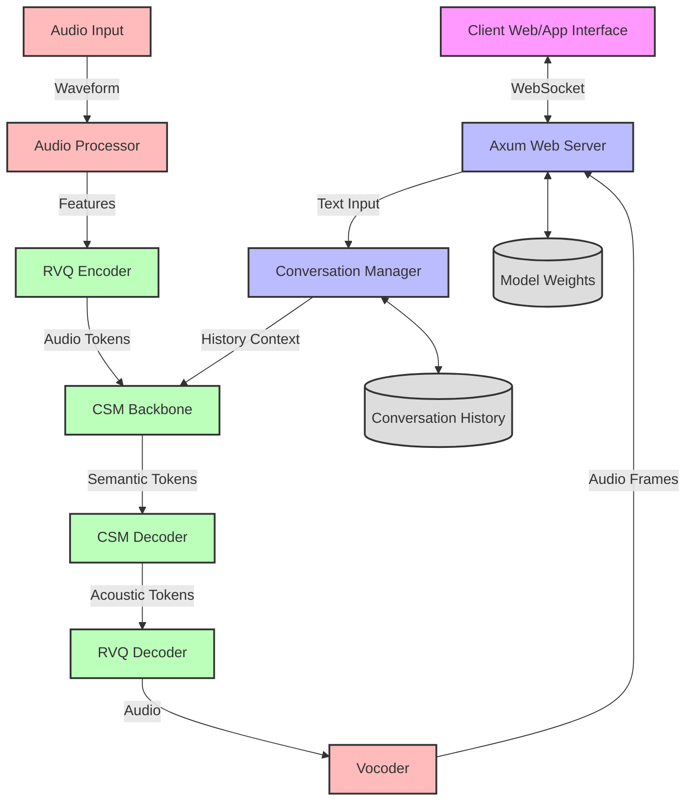

# CSM System Architecture

This document outlines the high-level architecture of the Conversational Speech Model (CSM) system.

## System Components

## Component Descriptions

### Client-Facing Components
- **Client Interface**: Web or app interface that connects to the server via WebSockets, sending text/audio and receiving audio responses.
- **Axum Web Server**: Handles WebSocket connections, manages client sessions, and coordinates the various processing components.

### Text Processing
- **Conversation Manager**: Maintains conversation history, handles context windowing, and prepares input for the CSM Backbone.

### Speech Synthesis Pipeline
- **CSM Backbone**: Transforms text and context into semantic tokens that represent speech content.
- **CSM Decoder**: Converts semantic tokens to acoustic tokens that represent detailed audio characteristics.
- **RVQ Decoder**: Transforms acoustic tokens (from codebooks) into raw audio features.
- **Vocoder**: Converts audio features into playable waveforms, optimized for streaming.

### Speech Recognition Pipeline
- **Audio Processor**: Handles incoming audio, performs preprocessing and feature extraction.
- **RVQ Encoder**: Converts audio features into tokens using residual vector quantization.

### Storage Components
- **Model Weights**: Storage for trained model parameters, including backbone, decoder, and vocoder weights.
- **Conversation History**: Persistent storage for conversation contexts.

## Data Flow

1. A client connects to the server via WebSocket.
2. The client sends text input or audio to the server.
3. For text input:
   - Text is processed by the Conversation Manager, adding context from history.
   - CSM Backbone generates semantic tokens representing speech content.
   - CSM Decoder transforms semantic tokens into acoustic tokens.
   - RVQ Decoder converts acoustic tokens to audio features.
   - Vocoder transforms features into audio waveforms.
   - Audio is streamed back to the client in chunks via WebSocket.
4. For audio input:
   - Audio is processed by the Audio Processor.
   - RVQ Encoder converts audio to tokens.
   - Tokens are passed to the CSM Backbone for understanding or response generation.

## Deployment Architecture

The system is designed to be deployed as:
- A set of containerized services for each major component
- Vertical scaling for resource-intensive components (CSM Backbone, Decoder)
- Horizontal scaling for client-facing components (Web Server) 